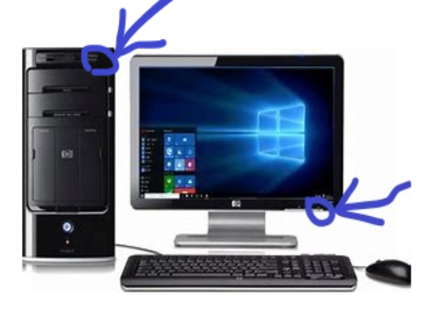
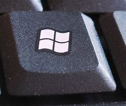
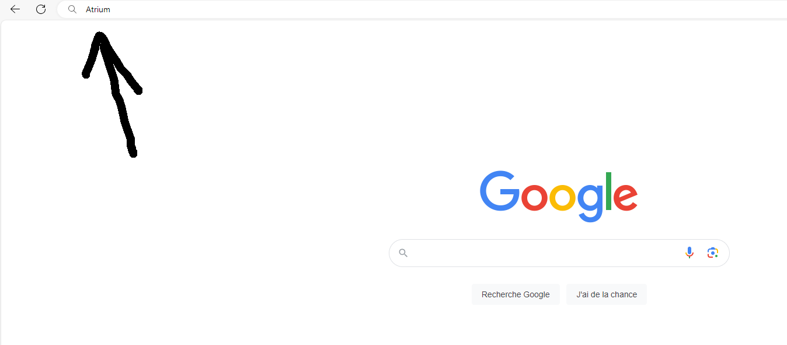
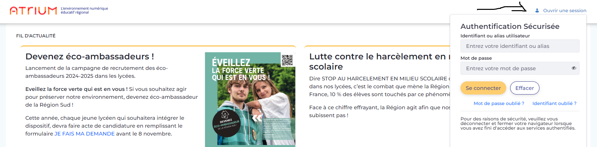
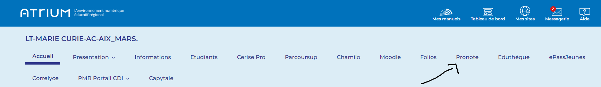

# Prise en Main de Pronote
## Etape 1: Allumer  l'ordinateur
1. Allumer la tour et ecran :

2. Rentrer vos identifiants et mots de passe

## Etape 2: Aller sur google

1. appuyer sur windows

2. ecrire "Google" puis faite entrer

## Etape 3: Aller sur Atruim

3. ecrire dans la barre de recherche "Atruim"

4. Cliquer sur le premier lien

5. entrer vos identifiants mots de passe

6. faire Entrer

## Etape 4: Aller dans emploie du temps Pronote

1. cliquer sur pronote

2. puis aller dans emploie du temps

